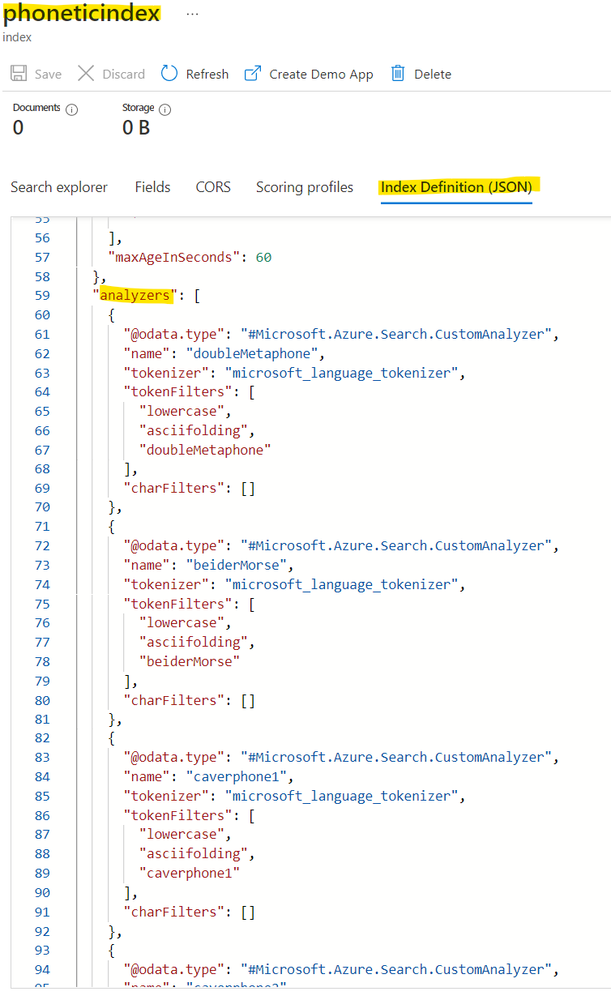

# Azure Cognitive Search - Customer Analyzers & Phonetic Search (.NET SDK)

This repo contains scripts to setup an index with phonetic search to help evaluate and benchmark the [phonetic encoders](https://docs.microsoft.com/en-us/dotnet/api/azure.search.documents.indexes.models.phoneticencoder?view=azure-dotnet).

Read through tutorial for [Custom Analyzer for phone numbers](https://learn.microsoft.com/en-us/azure/search/tutorial-create-custom-analyzer) in Azure Cognitive Search for details on how custom analyzers work.

## Pre-work

1. Understand how the [Cognitive Search .NET SDK](https://docs.microsoft.com/en-us/dotnet/api/overview/azure/search.documents-readme) works.
1. Azure Sbuscription is needed.
1. Setup the [Azure Cognitive Search service](https://docs.microsoft.com/en-us/azure/search/search-create-service-portal).

## Setup the Environment

### Build the .NET solution

In VS Code open terminal

```bash
dotnet restore
dotnet build
```

### Setup Variables

Setup the Cognitive Search connection information environment variables.

If using bash:

```bash
export SEARCH_ENDPOINT="<Your Azure Cognitive Search Endpoint>"
export SEARCH_API_KEY="<Your Search API Key>"
```

If using PowerShell:

```powershell
$env:SEARCH_ENDPOINT="<Your Azure Cognitive Search Endpoint>"
$env:SEARCH_API_KEY="<Your Search API Key>"
```

## Run the Sample Code

Run the Create Phonetic Index script. This Console App will setup an index with the name "phoneticindex". Additionally, it will create the 11 analyzers with the phonetic encoding options available.

```bash
dotnet run
```

Output:

```bash
Starting Index Creation: phoneticindex
Completed index Creation: phoneticindex
```

Go to the Azure portal, find your Azure Cognitive Search service, go to the indexes and click on the "phoneticindex" and look at the Index Definition, you will see the analyzers setup. See below screenshot for reference.


